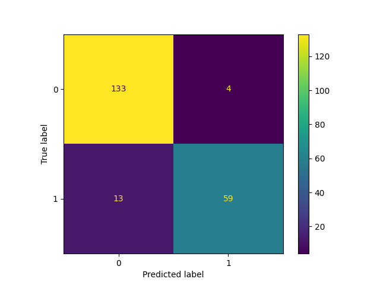
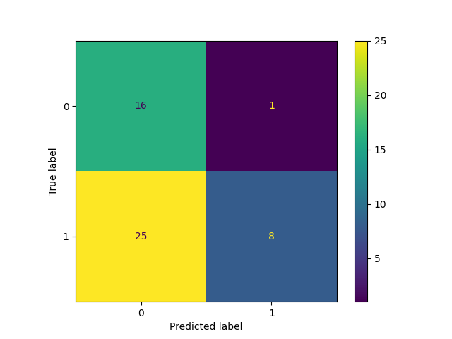
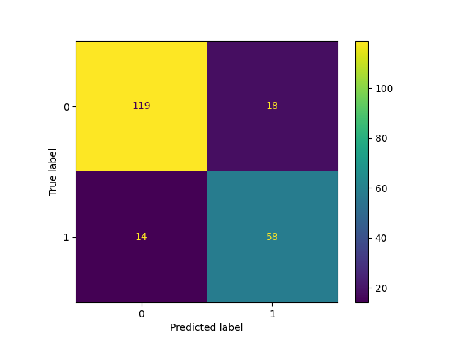
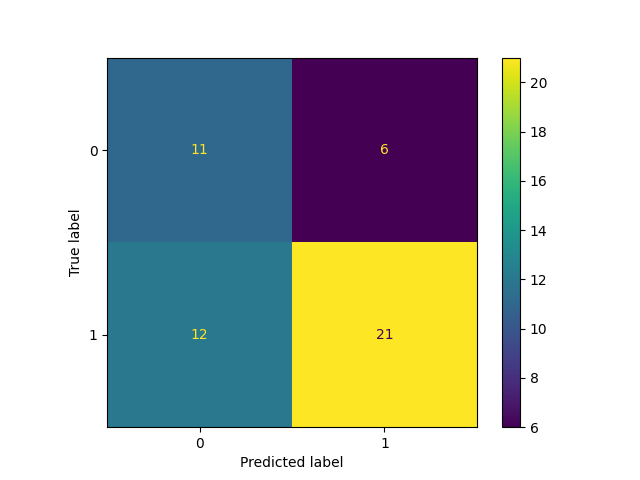
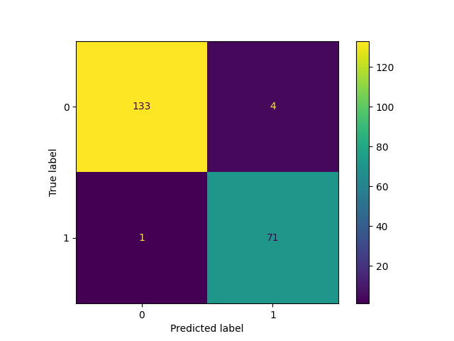
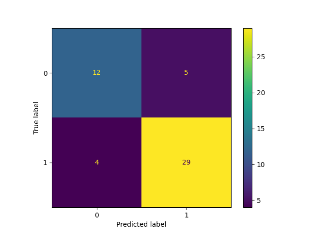

# Trabalho Prático - Gato vs Não-Gato

**Gabriel Medeiros Lopes Carneiro (19103977)**

**Mikaella Cristina Bernardo Vieira (18103860)**


## Enunciado

Reconhecimento de padrões é o processo de treinamento de uma rede neural para atribuir uma classe correta para um conjunto de padrões de entrada. 
Uma vez treinada, a rede pode ser usada para classificar padrões que não tenha visto antes.
 
Neste trabalho, um conjunto de dados deve ser usado para treinar e testar uma rede neural, que classifica imagens em "gatos" e "não gatos".

Os dados para treinamento, validação e teste foram obtidos a partir de uma base fornecida no curso de deep learning do Andrew Ng.

Os parâmetros de entrada para a rede são imagens rgb colocados em uma matriz de 64x64x3 (4096 pixeis coloridos).

E a saída é o valor correto da classificação, sendo que o dígito 0 corresponde a "Não Gato" e 1 corresponde a "Gato".

Este exercício pode ser feito em qualquer linguagem/ambiente. 

Experimente resolver o problema com um perceptron apenas (regressão logística), uma rede de camada rasa e uma rede convolucional (esta última é opcional).
Além da demonstração das redes funcionando, um Relatório completo deve ser entregue, contendo informações de Quantos e Quais experimentos foram feitos até chegar no resultado final; Como foi o treinamento; Qual a taxa de acertos da rede; A matriz de confusão, etc...

## Execução

```shell
python3 regressao_logistica.py
```

```shell
python3 neural_network.py
```

```shell
python3 convolucional_network.py
```

Caso tenha algum problema em algum dos arquivos, instale as dependências com

```shell
pip install -r requirements.txt
```


## Regressão Logística

### Treinamento

Foram testados vários valores de épocas e taxa de aprendizado até se chegar um valor ideal, que entregasse taxas aceitáveis de acertos dos dados de treino e teste, onde uma combinação de valores testado, por exemplo, com um número de épocas igual a 500 e a taxa de aprendizado igual a 0.02, o que gerou 71% de acertos dos dados de treino e 36% de acertos nos dados de teste, o que não são bons valores para um perceptron, mas testando vários outros valores até se chegar em um bom resultado, concluímos que uma combinação possível é o número de épocas igual a 2200 e a taxa de aprendizado como sendo 0.001, onde tivemos 70% dos acertos nos dados de teste e cerca de 91% de acertos nos dados do treino.

### Taxa de Acertos

A taxa de acerto para dos dados de treino foi de cerca de 91%, já a taxa de acerto dos dados de teste essa taxa foi para cerca de 70% como podemos observar na imagem abaixo obtida da execução do algoritmo do perceptron.

### Matriz de Confusão (Treino)

A seguir temos a matriz de confusão de treinamento, onde das 209 imagens de gatos dos dados de treinamento o perceptron acertou 192 imagens, o que para os dados de treinamento para a regressão logística, 91% é um número bom de acertos.



### Matriz de Confusão (Teste)

Logo abaixo temos a matriz de confusão dos dados de teste, para termos uma visão melhor do resultado, onde podemos notar que o perceptron acertou 35 das 50 fotos de gatos nos dados de teste, o que é um resultado bom para um perceptron.



## Rede de camada rasa

### Treinamento

O treinamento se mostrou algo bem complexo, dado a aleatoriedade das soluções.
A taxa de aprendizado foi alterada entre valores de 0.001 até 1, mas a que mostrou melhores resultados fui em 0.005.
O número de neurônios foi alterado para valores entre 5 e 1000, o de melhor resultado foi em 100.
O batch_size foi testado com 1 e 64, optamos por ficar com 64 pelos valores mais consistentes.
Por fim, o número de épocas ficou em 200, visto que acima disso a maioria das execuções apresentava sobre treinamento.

### Taxa de Acertos

A taxa de acertos ainda varia bastante, atingindo 98% para treinamento e 86% para testes (com sorte), os valores médios ficaram em 80% e 70%, respectivamente.
O pior cenário encontrado foi com 65% para treino e 35% para teste.

### Matriz de Confusão (Treino)

Segue um exemplo obtido em uma das execuções:



### Matriz de Confusão (Teste)

Segue um exemplo obtido em uma das execuções:



## Rede Convolucional

### Treinamento

Aqui os problemas da rede rasa se repetem, porém, com a adição da escolha do número de camadas.
O melhor resultado obtido foi com uma camada intermediária com 200 neurônios, taxa de aprendizado em 0.05, 400 épocas (com paciência), demais parâmetros igual a rede rasa.
Os resultados obtidos não ficaram muito melhores do que com as redes anteriores, mas a acurácia apresentou valores melhores mais vezes durante as execuções.

### Taxa de Acertos

Os resultados obtidos não ficaram muito melhores do que com as redes anteriores, mas a acurácia apresentou valores melhores mais vezes durante as execuções.
Frequentemente se obtêm mais de 95% no treinamento e 75% no teste. 

### Matriz de Confusão (Treino)



### Matriz de Confusão (Teste)


