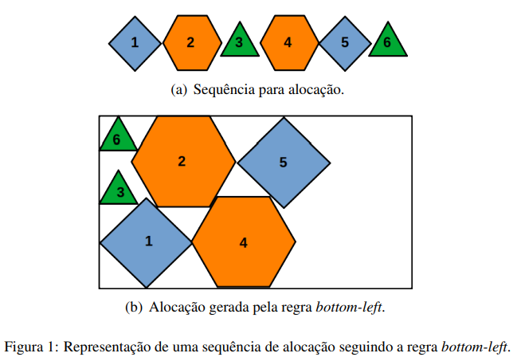

# Aprendizado por reforço: aplicação no problema de empacotamento

**Gabriel Medeiros Lopes Carneiro (19103977)**

**Mikaella Cristina Bernardo Vieira (18103860)**

---
## Problema de Empacotamento

- Alocar conjunto de objetos dentro de um objeto maior.
  - Ex.: caixas em container.
- Objetos podem ser regulares ou não.
  - Quantidade de parâmetros necessários para identificação.
- O objeto maior pode ter dimensões fixas ou não.

---
### Empacotamento de peças irregulares

- Peças irregulares bidimensionais.
- Objeto retangular de altura fixa.

---
### Solução: _Botton-left_

---
## Aprendizado por reforço

- Baseado na qualidade das decisões tomadas.
  - Decisões serão analisadas e receberão recompensas e penalidades.
- Recompensas podem ser iguais independentes da qualidade da solução ou não. 
- Analise pode ser feita passo a passo ou ao final da solução.
  - Com alto número de repetições é possível superar as limitações de cada método.
- _Q-learning_.

---
### Matriz de Aprendizado

- Representação do método _Q-learning_.
- $Q (n \times m)$.
  - $n$ quantidade de tipos de peça.
  - $m$ tamanho total da sequência.

---
## Transferência de aprendizado

---
## Referências
