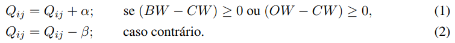
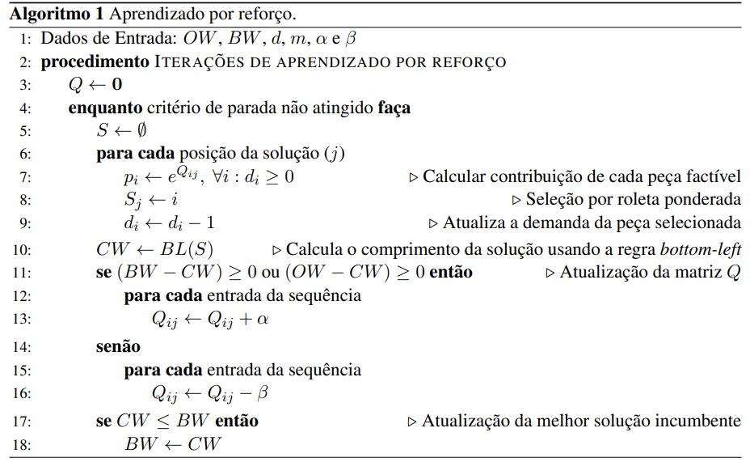
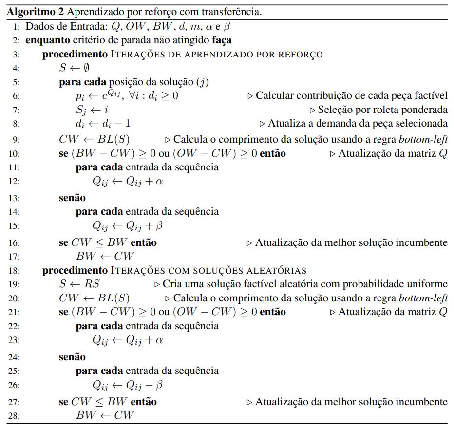
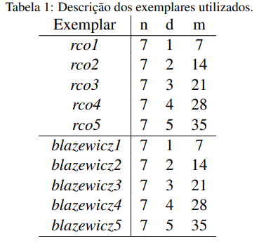
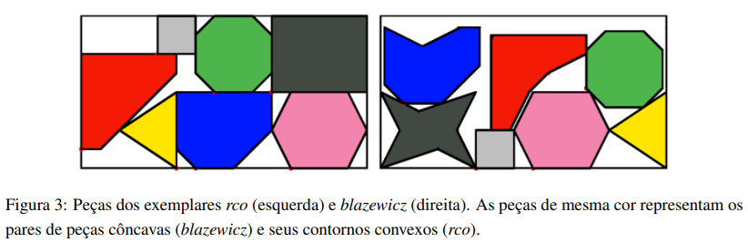
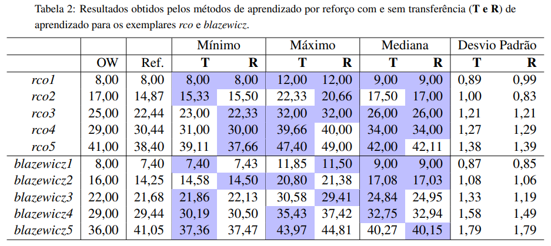

# Aprendizado por reforço: aplicação no problema de empacotamento

**Gabriel Medeiros Lopes Carneiro (19103977)**

**Mikaella Cristina Bernardo Vieira (18103860)**

---
## Problema de Empacotamento

- Alocar conjunto de objetos dentro de um objeto maior.
  - Ex.: caixas em container.
- Objetos podem ser regulares ou não.
  - Quantidade de parâmetros necessários para identificação.
- O objeto maior pode ter dimensões fixas ou não.

---
### Empacotamento de peças irregulares

- Peças irregulares bidimensionais.
- Objeto retangular de altura fixa.

---
### _Botton-left_

---
## Aprendizado por reforço

- Baseado na qualidade das decisões tomadas.
  - Decisões serão analisadas e receberão recompensas e penalidades.
- Recompensas podem ser iguais independentes da qualidade da solução ou não. 

---
## Aprendizado por reforço

- Analise pode ser feita passo a passo ou ao final da solução.
  - Com alto número de repetições é possível superar as limitações de cada método.
- _Q-learning_.

---
### Matriz de Aprendizado

- Representação do método _Q-learning_.
- $Q (n \times m)$.
  - $n$ quantidade de tipos de peça.
  - $m$ tamanho total da sequência.
- $Q_{ij}$ representa o benefício do uso de uma peça do tipo $i$ na posição $j$.
- A matriz é atualiza a cada solução gerada.

---

---
## Transferência de aprendizado

- A maioria das peças são similares.
  - Criar matriz de aprendizado e repassar para novas soluções.
- Matriz de aprendizado precisa ser redimensionada.
- Iterações puramente aleatórias 
  - Adaptação ao novo exemplar.

---

---
## Comparativo

- Aprendizado por reforço (R).
  - 700 segundos.
- Transferência de aprendizado (T).
  - 600 segundos para geração de $Q$.
  - 100 segundos no algoritmo 2.

---
## Comparativo

- 10 exemplares.
  - 5 de peças convexas (rco).
  - 5 com peças côncavas (blazewicz).

---
## Comparativo

- Exemplares côncavos tiveram menos iterações.
  - Maior possibilidade de posições devido aos vértices.

---
### Resultados

---
## Conclusão

- Peças côncavas exigem maior esforço para solução.
- Transferência de aprendizado traz vantagens.
  - Desempenho similar ao aprendizado por reforço, com tempo de execução menor.
- A medida que nº de exemplares cresce, a transferência encontrou melhores comprimentos mínimos.

---
## Referências

- Bartmeyer, P., Oliveira, L., Toledo, F. e Leão, A. (2021). [Aprendizado por reforço aplicado ao problema de empacotamento de peças irregulares em faixas](https://repositorio.usp.br/directbitstream/455094df-864a-4fad-8a97-c5f59fd3d6ca/3051981.pdf). **LIII Simpósio Brasileiro de Pesquisa Operacional**.
- Watkins, C. J. e Dayan, P. (1992). Q-learning. Machine learning, 8(3-4):279–292.